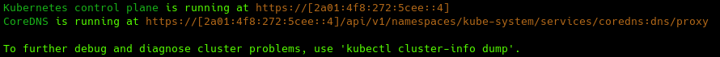

# Prerequisites

## Freeberbetes Cloud Platform

This tutorial leverages the [Freebernetes Cloud Platform](https://try-fcp.org/) with the aim of introducing and teaching elementary skills of working with Kubernetes cluster.

..

To start working with the cluster, you must send a request to create a new Kubernetes installation via the POST method:

```
{
      "init_masters": "1",
      "init_workers": "0",
      "email": "EMAIL"
    }
```

...





Next: [Lesson 2: Configuring PVC](02-configuring-pvc.md)
